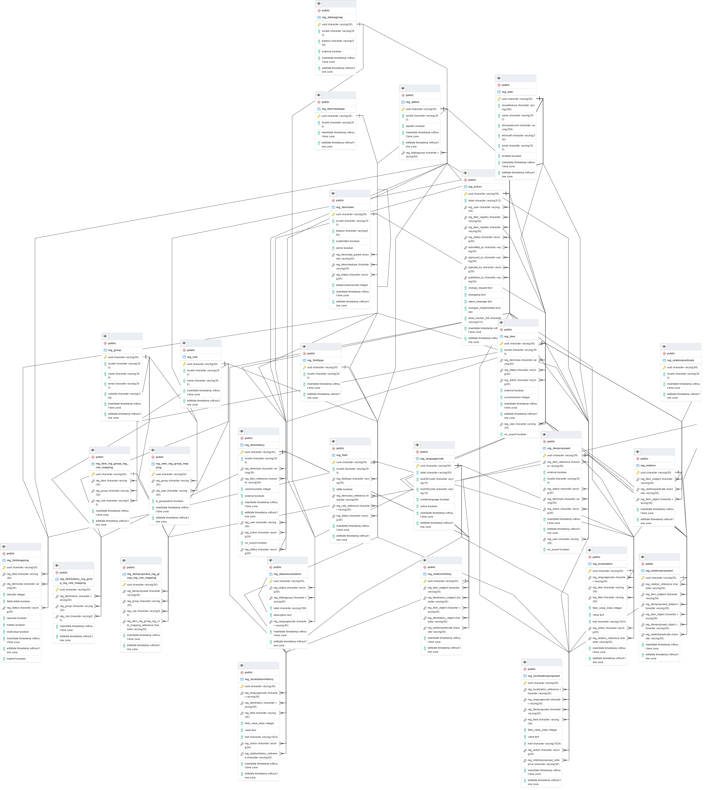

# Database manual

## Scope

This manual is intended for users that are going to install and set-up the Re3gistry 2 software.

The following documentation provides details related to the database used for the Re3gistry 2 software. If you want to have more information refer to the [User manual](user-manual.md) or more information on the [Developer manual](developer-manual.md) or to the [Administrator manual](administrator-manual.md).

This is a live document; it is being improved continuously. To have the last version you can refer to https://github.com/ec-jrc/re3gistry.

Please report any feedback on the documentation [in the GitHub issue tracker](https://github.com/ec-jrc/re3gistry/issues).

## Overview

The Re3gistry 2 is a reusable open source solution for managing and sharing "reference codes".

This manual will cover the following topics:
* Structure of the database
* [For admin only] How to initialize database
* [For developer only] Relations between tables

The prerequisites to follow this manual are:
* to have PostgreSQL database server installed and configured (or an alternative relational database server)

## Structure of the database

The database initialization file can be found in the following file dist/db-scripts/registry2_drop-and-create-and-init.sql.orig

The database is created from 27 tables from which many of them are acting as a cluster on the join queries and this clusters are as well interconneted.

In this manual we will refer as item everything that stays in the reg_item table, reg_itemproposed and reg_itemhistory tables.

### Clusters with single tables:
#### reg_languagecode: contains all the system languages. The system MUST have one master language in which all the items should be tranlated. The table can contain more languages but just the active one are used by the system.

#### reg_relationpredicate: contains actions that should be represented between items, such as "hasRegistry" to assign to an item this relation when there is a relation between this item and the registry or the action "hasParent" when there is this relation between 2 items.

### Clusters with more than one table: 
#### reg_fieldtype, reg_field and reg_fieldmapping tables. 
The table reg_fieldtype contains the types that one field can take, such as text, number or date. The same tables contains as well some special types of fields such as: relationReference which is assign to a field that points to another reg_itemclass, "collection" which is filled when a reg_item has a hierarchy and this is the collection container, "parent" which is filled with the reg_item that is a parent for the respectiv reg_item, the successor and predecessor are other fileds that usually are filled when a reg_item is superseded.

For the Entity Relationship Diaglam see the bellow image

And for more details on how the tables are connected please refer to the ## [For developer only] Relations between tables

## [For admin only] How is initialize database - Distribution package

The [distribution folder](../dist/) contains all the file required for the Re3gistry 2 system installation. Download the distribution package and check the folder content.  
The "db-script" folder contains the database initialization script.

In particular, the `init.properties` contains the properties to be customised (detailed below).

* dbhost: the address of the database to be used by the Re3gistry 2 (e.g. 192.168.0.1)
* dbport: the port of the database (e.g. 5432)
* dbname: the name of the database (e.g. re3gistry2_db)
* dbuser: the user to access the database
* dbpassword: the password to access the database
* statusbaseuri: the status base URI is the first part of the URL of the status contained in the system. Usually this URI is the same of the main URL of the service but since in some cases it may be different, the Re3gistry system is providing this option (e.g. https://test-uri.eu).

### Database setup

The first step is to run the database initialization script on the database created for the Re3gistry 2 (if you do not have a database, create a new one).

Run the SQL script available in `dist/db-scripts/registry2_drop-and-create-and-init.sql`
(customized following the steps presented in the previous section).

## [For developer only] Relations between tables - Source package

