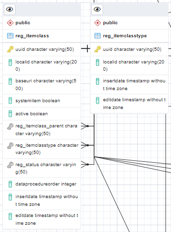

# Database manual

## Scope

This manual is intended for users that are going to install and set-up the Re3gistry 2 software.

The following documentation provides details related to the database used for the Re3gistry 2 software. If you want to have more information refer to the [User manual](user-manual.md) or more information on the [Developer manual](developer-manual.md) or to the [Administrator manual](administrator-manual.md).

This is a live document; it is being improved continuously. To have the last version you can refer to https://github.com/ec-jrc/re3gistry.

Please report any feedback on the documentation [in the GitHub issue tracker](https://github.com/ec-jrc/re3gistry/issues).

## Overview

The Re3gistry 2 is a reusable open source solution for managing and sharing "reference codes".

This manual will cover the following topics:
* [For developer only] Structure of the database - Relations between tables
* [For admin only] How to initialize database

The prerequisites to follow this manual are:
* to have PostgreSQL database server installed and configured (or an alternative relational database server)

## For developer only] Structure of the database - Relations between tables

The database initialization file can be found in the following file dist/db-scripts/registry2_drop-and-create-and-init.sql.orig

The database is created from 27 tables from which many of them are acting as a cluster on the join queries and this clusters are as well interconneted.

In this manual we will refer as item everything that stays in the reg_item table, reg_itemproposed and reg_itemhistory tables.

### Clusters with single tables:
#### reg_languagecode: contains all the system languages. The system MUST have one master language in which all the items should be tranlated. The table can contain more languages but just the active one are used by the system.

#### reg_relationpredicate: contains actions that should be represented between items, such as "hasRegistry" to assign to an item this relation when there is a relation between this item and the registry or the action "hasParent" when there is this relation between 2 items.

### Clusters with more than one table: 
#### reg_fieldtype, reg_field and reg_fieldmapping tables. 
The table reg_fieldtype contains the types that one field can take, such as text, number or date. The same tables contains as well some special types of fields such as: relationReference which is assign to a field that points to another reg_itemclass, "collection" which is filled when a reg_item has a hierarchy and this is the collection container, "parent" which is filled with the reg_item that is a parent for the respectiv reg_item, the successor and predecessor are other fileds that usually are filled when a reg_item is superseded.

#### reg_itemclass and reg_itemclasstype tables:
The table reg_itemclass contains the name of the registry, of the registers and all the related hierarchies called items. The name that is give in this table to the registry, registers and items is used to compose the URI. In this table there are as well the relations between a certain registrers and related registry, between item and registers. 
The table reg_itemclasstype contains the 3 different types of itemclasses presented in the system such as registry, register and item.

#### reg_user, reg_role, reg_group and reg_user_reg_group_mapping tables:
The table reg_user contains the information related to the system user.
An user can be assign to a group or more groups, taken from the table reg_group. This relation is stored in the table reg_user_reg_group_mapping.
The table reg_role contains the roles assigned the system: such as submitting organization, control body, register and registry manager and regiser owner.

#### reg_status, reg_statusgroup and reg_statuslocalization
The table reg_status group contain the status group that could be seens as a container. This container contain the URI that is going to be used to link the children status. 
The table reg_status contain all the values that the status group can have. Each value points to the status group related. 
The table reg_statuslocalization conatins the translation of the reg_statusgroup and reg_status values.

#### reg_item, reg_localization, reg_relation and reg_item_reg_group_reg_role_mapping
The table reg_item contains all the items of the system, beeing a registry, a register or a simple item with the current/latest version. 
This items are localized in the table reg_localization. 
The table reg_relation stores the relations between items. The relations can be parent relation, successor/predecessor relation, collection relation, rederence to another item part of a different reg_itemclass.
The table reg_item_reg_group_reg_role_mapping stores the relations between an item and the group of users that have create it with the associated reg_role.

Similar clusters there are for storing item proposed, so item that have been submited by the submitting organization to the control body or items that are history of the latest version of an item.

#### reg_itemproposed, reg_localizationproposed, reg_relationproposed and reg_itemproposed_reg_group_reg_role_mapping
The table reg_itemproposed contains all the items proposed of the system, beeing a registry, a register or a simple item that are not yet public but they have been submited by the submitting organization to the control body. 
This items proposed are localized in the table reg_localizationproposed. 
The table reg_relationproposed stores the relations between items. The relations can be parent relation, successor/predecessor relation, collection relation, rederence to another item part of a different reg_itemclass. The items relations can be a valid item or another item proposed.
The table reg_itemproposed_reg_group_reg_role_mapping stores the relations between an item proposed and the group of users that have create it with the associated reg_role.

#### reg_itemhistory, reg_localizationhistory, reg_relationhistory and reg_itemhistory_reg_group_reg_role_mapping
The table reg_itemhistory contains all the history items of the system, beeing a registry, a register or a simple item that have been edited and now are part of the history of an item. This items have a correspondent item in the reg_item table which is the latest version of that item.
This items history are localized in the table reg_localizationhistory. 
The table reg_relationhistory stores the relations between items. The relations can be parent relation, successor/predecessor relation, collection relation, rederence to another item part of a different reg_itemclass. The items relations can be a valid item or another item history.
The table reg_itemhistory_reg_group_reg_role_mapping stores the relations between an item history and the group of users that have create it with the associated reg_role.

And as last still a
### Cluster with single table:
#### reg_action table
Reg_action table contains all the changes related to an action of submitting, rejecting, accepting or publishing. An action is related to one or more items from the table reg_item. 

For the Entity Relationship Diaglam see [the bellow image](images/database_structure.png)

## [For admin only] How is initialize database - Distribution package

The [distribution folder](../dist/) contains all the file required for the Re3gistry 2 system installation. Download the distribution package and check the folder content.  
The "db-script" folder contains the database initialization script.

In particular, the `init.properties` contains the properties to be customised (detailed below).

* dbhost: the address of the database to be used by the Re3gistry 2 (e.g. 192.168.0.1)
* dbport: the port of the database (e.g. 5432)
* dbname: the name of the database (e.g. re3gistry2_db)
* dbuser: the user to access the database
* dbpassword: the password to access the database
* statusbaseuri: the status base URI is the first part of the URL of the status contained in the system. Usually this URI is the same of the main URL of the service but since in some cases it may be different, the Re3gistry system is providing this option (e.g. https://test-uri.eu).

### Database setup

The first step is to run the database initialization script on the database created for the Re3gistry 2 (if you do not have a database, create a new one).

Run the SQL script available in `dist/db-scripts/registry2_drop-and-create-and-init.sql`
(customized following the steps presented in the previous section).
